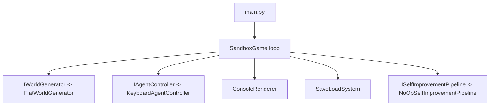

# AI Agent Sandbox Game Prototype

Minimal local single-player sandbox scaffold with an interactive loop.

## Project Structure

- `game/engine/` - core loop and interfaces.
- `game/world/` - world generation/loading logic.
- `game/ai/` - input controller and self-improvement pipeline placeholder.
- `game/systems/` - persistence (save/load).
- `game/ui/` - console rendering.
- `server/` - future server/multiplayer module.

## Setup

```bash
python3 --version
```

No third-party dependencies are required.

## Run

```bash
python3 main.py
```

Controls in game:
- `w`, `a`, `s`, `d`: move player
- `save`: save current world state to `savegame.json`
- `load`: load from `savegame.json`
- `quit`: end session

## Architecture


